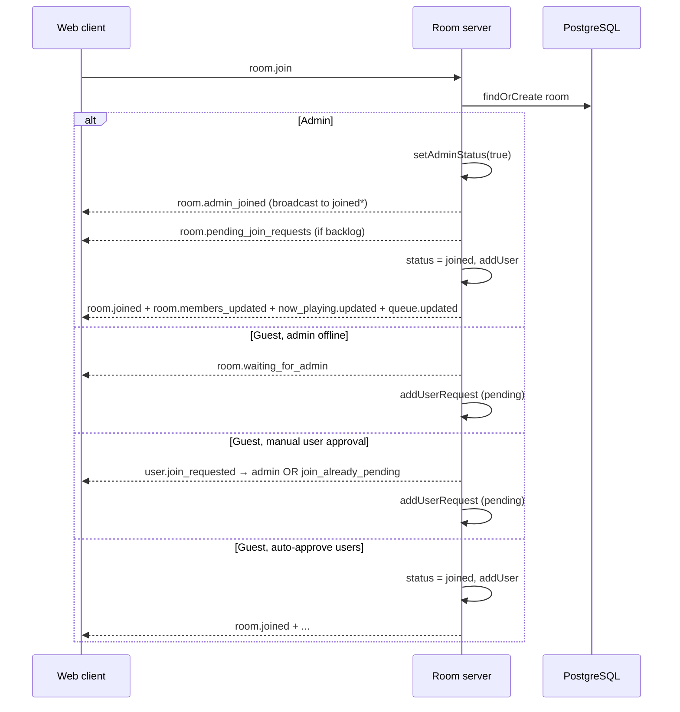

# WebSocket Event Flow

Spotofy uses a single persistent WebSocket (`NEXT_PUBLIC_WS_URL` → room-server). Messages are JSON with a `type` field (see `ClientEvents` / `ServerEvents` in `apps/*/src/constants.ts` or `apps/web/lib/constants.ts`).

**Client state** lives in `useWebSocket` (`apps/web/hooks/useWebSocket.ts`). **Server state** is in-memory per room (`Room` class + `connections` map in `handerFunctions.ts`), with songs/users persisted via Prisma.

---

## Client → Server (`ClientEvents`)

| Event | Who | Server handler | DB / room ops | Server replies |
|-------|-----|----------------|---------------|----------------|
| `room.join` | Anyone | `handleJoinRoom` | Load/create room; track connection as `pending` then maybe `joined` | See [Join flow](#join-flow) |
| `song.request` | Joined user* | `handleRequestSong` | Create song (`REQUESTED` or `QUEUED`) | `queue.updated` (auto-approve) **or** `song.requested` → admin |
| `song.upvote` | Joined user* | `handleUpvote` | Insert upvote history; increment count | `queue.updated` or `error` |
| `song.approve` | Admin* | `handleApproveSong` | `REQUESTED` → `QUEUED` | `song.approved` + `queue.updated` |
| `song.reject` | Admin* | `handleRejectSong` | `REQUESTED` → `REJECTED` | `song.rejected` |
| `user.approve` | Admin* | `handleApproveUser` | Move user from pending → joined | `room.joined`, `room.members_updated`, `now_playing.updated`, `queue.updated`, `user.approved` |
| `user.reject` | Admin* | `handleRejectUser` | Remove from pending list | `user.rejected` → target user |
| `now_playing.sync` | Any connected* | `handlePlayCurrentSong` | Read `PLAYING` or advance queue | `now_playing.updated` + `queue.updated` (broadcast) |
| `queue.next` | Admin* | `handleNextSong` | Delete current `PLAYING`; promote top `QUEUED` | `now_playing.updated` + `queue.updated` (broadcast) |

\*Handlers check room exists and admin where needed, but **do not verify `conn.status === "joined"`** (see gaps).

### Client-side after send

| Action | Hook / UI effect |
|--------|------------------|
| `joinRoom()` | Sets `joinState: "joining"`; waits for server events |
| `requestSong()` | No local state until server pushes queue or admin sees pending |
| `upvoteSong()` | Queue refreshed via `queue.updated` |
| `approveSong` / `rejectSong` | Admin optimistically removes from `pendingRequests` only after server events |
| `approveUser` / `rejectUser` | **Optimistically** removes from `pendingUsers` before server ack |
| `broadcastNowPlaying()` | **Exported but unused** in room UI |
| `requestNextSong()` | Called from admin Spotify player on track end / skip button → `queue.next` |

---

## Server → Client (`ServerEvents`)

| Event | Trigger | Client handler (`useWebSocket`) | UI effect |
|-------|---------|----------------------------------|-----------|
| `room.joined` | User fully joined | `joinState → joined`, set `roomConfig`, `queue` | Room layout shown (guest/admin) |
| `room.waiting_for_admin` | Guest joined before admin | `joinState → blocked`, clear room state | Join status screen |
| `user.join_already_pending` | Duplicate join request | **Not handled** (falls through to `console.warn`) | No UI change |
| `user.join_requested` | Guest needs approval | Append to `pendingUsers` | Admin: pending users panel |
| `room.pending_join_requests` | Admin joined with backlog | Set `pendingUsers` | Admin: pending users panel |
| `user.approved` | Admin approved guest | **Not handled** | Redundant if `room.joined` already received |
| `user.rejected` | Admin rejected guest | `joinState → rejected`, clear state | Join status screen |
| `room.admin_joined` | Admin connected | `isAdminJoined → true` | **Not consumed by room UI** |
| `room.admin_left` | Admin disconnected | `isAdminJoined → false` | **Not consumed by room UI** |
| `room.members_updated` | Join / leave / approve | Set `users` | Users sidebar |
| `queue.updated` | Queue changed | Set `queue` | Queue sidebar |
| `song.requested` | Manual song approval | Append to `pendingRequests` | Admin: pending songs panel |
| `song.approved` / `song.rejected` | Admin action | Remove from `pendingRequests` | Admin panel |
| `now_playing.updated` | Join / skip / sync / next | Set `nowPlaying` | Now playing section; admin Spotify player uses `nowPlaying.url` |
| `error` | Validation / auth failure | Toast via `reportError` | Sonner toast |

---

## Key end-to-end flows

### Join flow



\* `broadcastToRoom` only reaches connections with `status === "joined"`.

**After join (admin):** `playCurrentSong()` runs on join — if nothing is `PLAYING`, it **calls `playNextSong()`** and may start playback immediately.

**After join (guest):** Sees queue/users/now playing; playback is display-only from `nowPlaying`.

### Song request flow

```
Guest/Admin → song.request → DB create
  ├─ autoApproveSongs: queue.updated (all joined)
  └─ manual: song.requested → admin only
Admin → song.approve → song.approved + queue.updated
Admin → song.reject → song.rejected (no queue.updated; song leaves pending UI only)
```

### Playback flow

```
Admin Spotify SDK track ends / skip
  → requestNextSong() → queue.next
  → server playNextSong() (delete PLAYING, promote top QUEUED)
  → now_playing.updated + queue.updated → all joined clients

Admin player loads new nowPlaying.url → plays via Spotify Web API
Guests see now_playing.updated → static album art + metadata
```

`now_playing.sync` exists to re-broadcast current track but **nothing in the UI calls it**.

### Disconnect flow

```
WebSocket close/error → handleDisconnect
  ├─ Admin: setAdminStatus(false), room.admin_left (broadcast)
  ├─ Joined: removeUser
  └─ Pending: removeUserRequest
  → room.members_updated (broadcast)
```

No client rejoin logic; commented-out rejoin stub in `useWebSocket`.

---

## Gaps & edge cases

### Critical

1. **Guests stuck when joining before admin** — They receive `room.waiting_for_admin` and sit in `usersRequested`. When admin later joins, they are **not** notified (`room.admin_joined` is not broadcast to pending connections). With `autoApproveUsers: true`, they are still never auto-admitted; admin must manually approve users who were queued before admin arrived.

2. **No `joined` guard on actions** — Pending/waiting users can send `song.request`, `song.upvote`, etc. if they bypass UI. Server only checks `conn.user` exists, not `conn.status === "joined"`.

3. **Duplicate `room.join`** — Re-calling join (e.g. React effect re-run) resets connection to `pending` and re-processes join with no idempotency guard.

4. **Unhandled server events on client** — `user.join_already_pending` and `user.approved` have schemas but no `useWebSocket` cases.

5. **Admin song backlog on reconnect** — On admin join, pending **users** are sent via `room.pending_join_requests`, but pending **songs** in DB (`loadRequestedSongs`) are never loaded or sent. Admin only sees songs requested while they are online (`song.requested`).

### Moderate

6. **`playCurrentSong()` side effect on join** — Joining (or approving a user) can start playback by promoting the queue without admin explicitly pressing play.

7. **`room.admin_joined` / `room.admin_left` unused in UI** — `isAdminJoined` is tracked but room page ignores it; guests waiting for admin see a generic “blocked” message that reads like approval wait, not “admin offline”.

8. **`now_playing.sync` unused** — No path to resync guests after missed broadcasts or admin reconnect.

9. **Optimistic pending-user removal** — `approveUser` / `rejectUser` remove from UI before server confirms; failed requests leave UI out of sync.

10. **Duplicate song requests allowed** — Server comment acknowledges missing dedup (`handleRequestSong`).

11. **`maxUsers` / `maxUpvotes` not enforced** — Room config fields exist but handlers never check them.

12. **Admin multi-tab** — `sendToAdmin` delivers to first matching connection only; other admin tabs miss `song.requested` / `user.join_requested`.

13. **Room cache never evicted** — `roomCache` grows; empty rooms stay in memory until process restart.

14. **No WebSocket reconnect/rejoin** — Disconnect clears server-side presence; client stays on page with stale state until manual refresh.

### Minor

15. **Redundant payloads on join** — `room.joined` includes `queue`, then server also sends `queue.updated` with the same data.

16. **`USER_REJECTED` schema** — Server sends `{ type: "user.rejected" }` with no payload; client clears state (works, but asymmetric with other events).

17. **`findOrCreate` fallback** — If DB room missing, first joiner's `userId` is passed as `adminId` to `Room.findOrCreate` regardless of `user.isAdmin` flag.

18. **Song reject does not broadcast queue** — Correct for queue (song was never `QUEUED`), but requester gets no feedback event.

19. **Commented song-request timeout** — Auto-reject after timeout is stubbed in `room.ts`, not active.

---

## File map

| Layer | File |
|-------|------|
| Event constants | `apps/room-server/src/constants.ts`, `apps/web/lib/constants.ts` |
| Zod schemas | `apps/room-server/src/types.ts`, `apps/web/types/websocket.ts` |
| Server routing | `apps/room-server/src/handerFunctions.ts` |
| Room logic / DB | `apps/room-server/src/room.ts` |
| Client hook | `apps/web/hooks/useWebSocket.ts` |
| Room UI | `apps/web/app/room/[code]/_components/_client.tsx` |
| Admin playback | `now-playing-section.tsx`, `spotify-player.tsx` |
